# Advanced_Lane_Finding

The goal of this project is to find lines on the highway video frame. In addition, it displays the radius of curvature and the offset from the car.

## Camera Calibration

In general, images or videos taken with the camera are distorted by the lens. These images can cause problems when calculating the radius of curvature or the centerline offset of the car. Perform camera calibration to correct this lens distortion. Calculated based on multiple images of a chess board shot with the same camera. You can then use this matrix to avoid distorting other images.
This project uses the calibration module implemented in opencv and saves it as a pickle file in Python and stores the camera metrics and distortion coefficients in advance.

Original                      |  Calibration
:----------------------------:|:------------------------------:
| 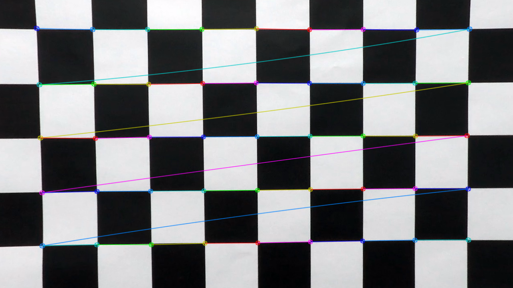
| 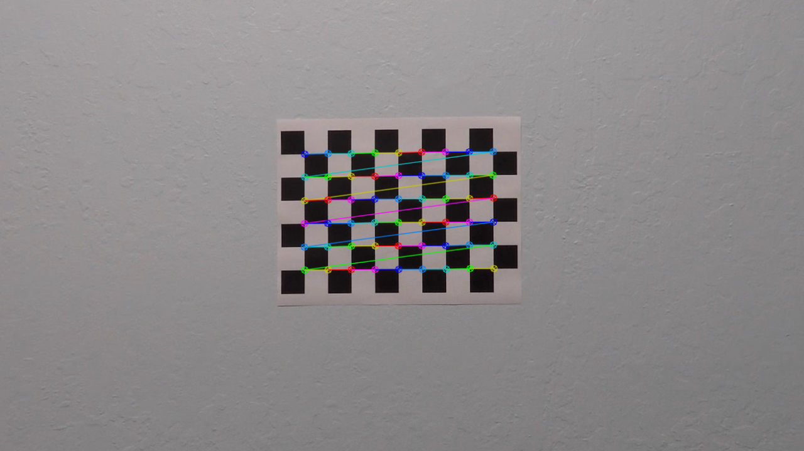

### Undistortion

The result of applying the calibration module to the image

Original                      |  Undistorted
:----------------------------:|:------------------------------:
| 
| 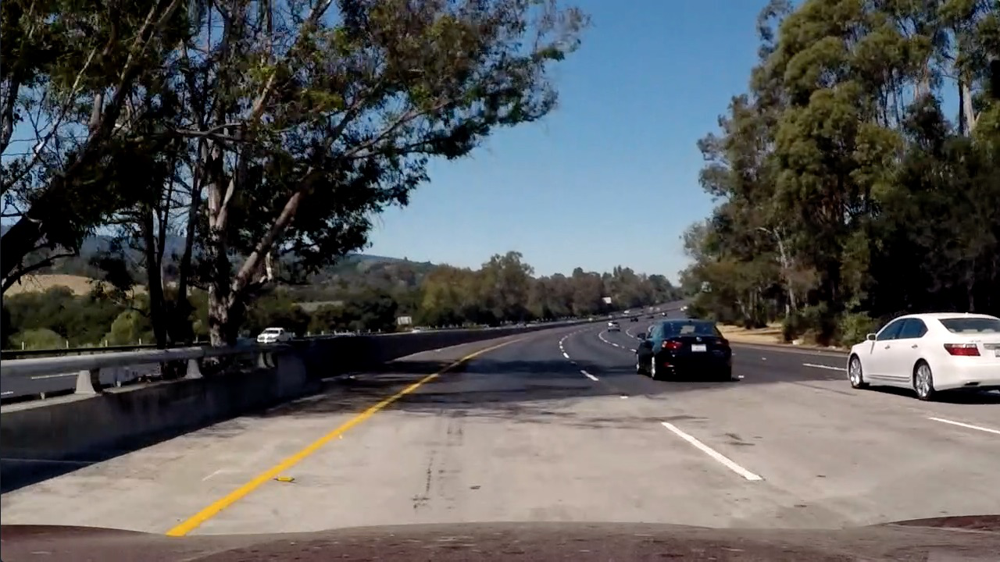

## Lane Masking

After the lens distortion is removed, the image is processed by binarizing the pixel and setting the threshold to better locate the lane. The techniques used here are the sobel mask and the direction of gradient. To find the parameters of these techniques, you need to create and compare images multiple times.

The first technique converts the HLS color space to obtain the saturation value of the image, which is well detected in the saturation color space. The white line uses the cv2.equalizeHist () function to perform Histogram equalization.

Next, it is used to perform a Sobel mask to obtain gradients in the x and y directions and is used to obtain size and direction threshold images.

Finally, specify the area of interest and mask it so that it focuses on the road ahead of the vehicle.

The final combine is shown below.

Sobel X & Y                   |  Magnitude & Direction of Gradient  | HLS    | Combined
:----------------------------:|:-----------------------------------:|:------:|:----------:
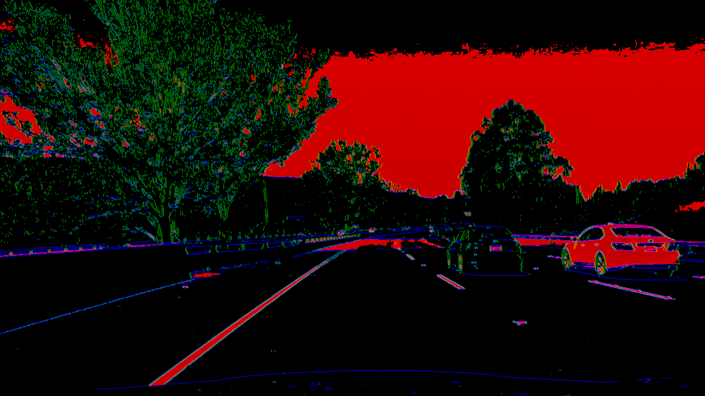| 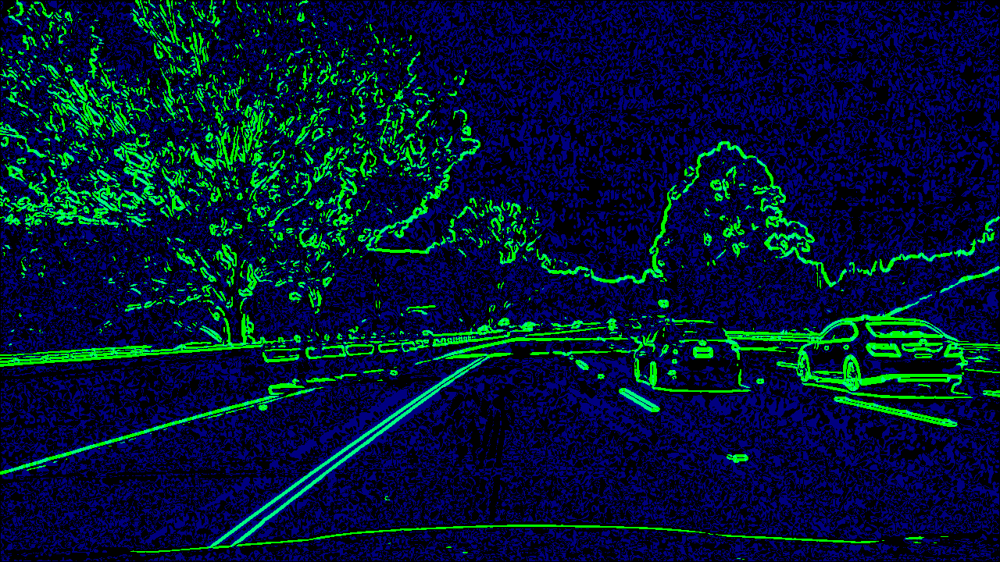 | 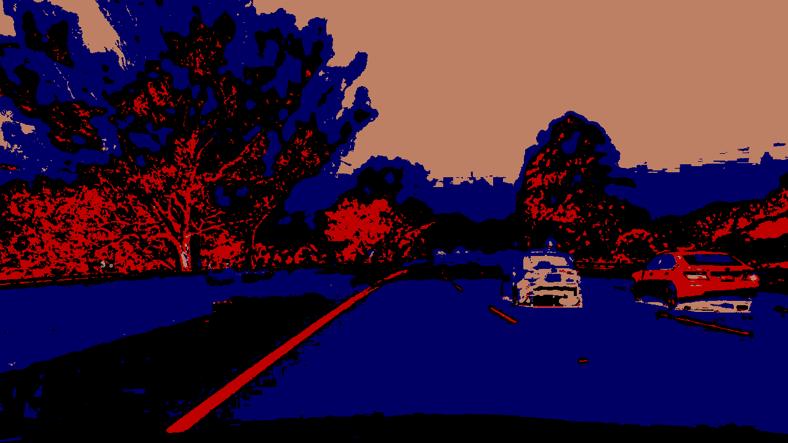 | 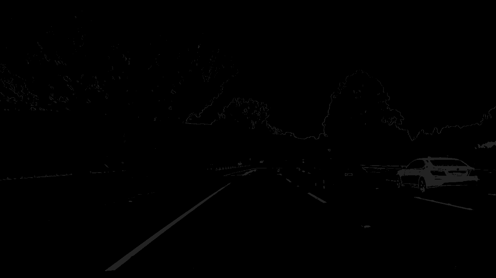
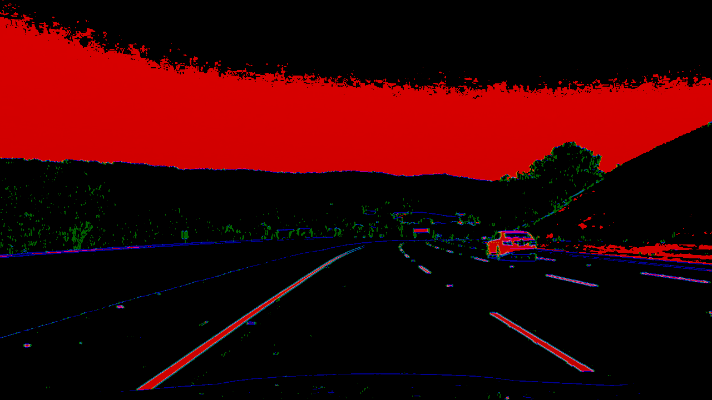|  | 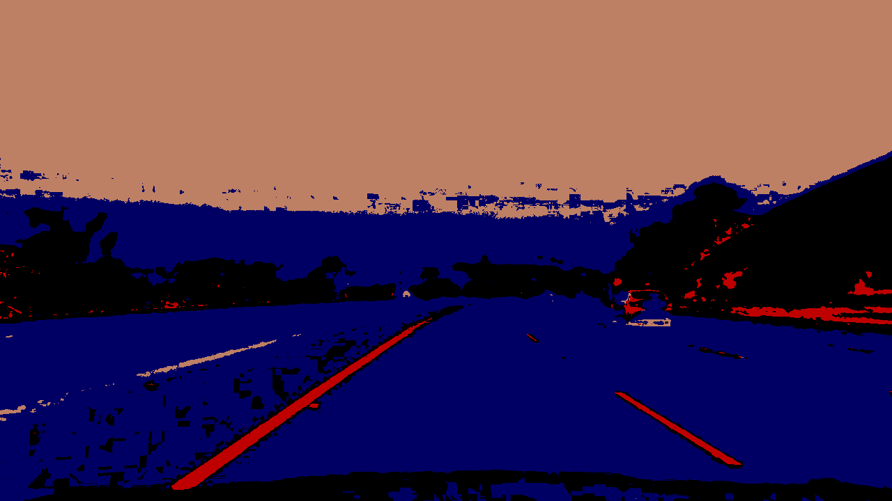 | 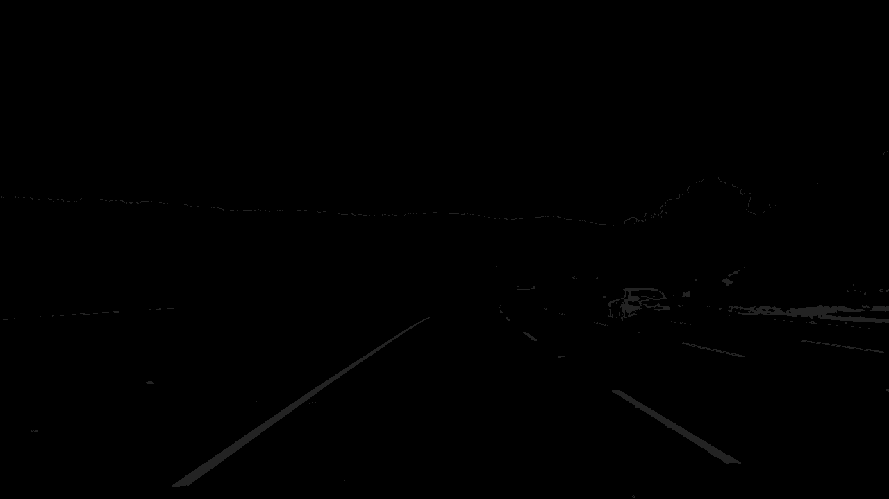
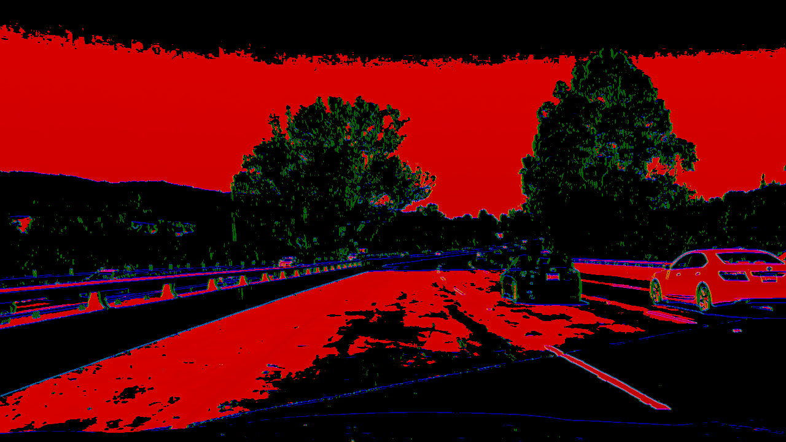| 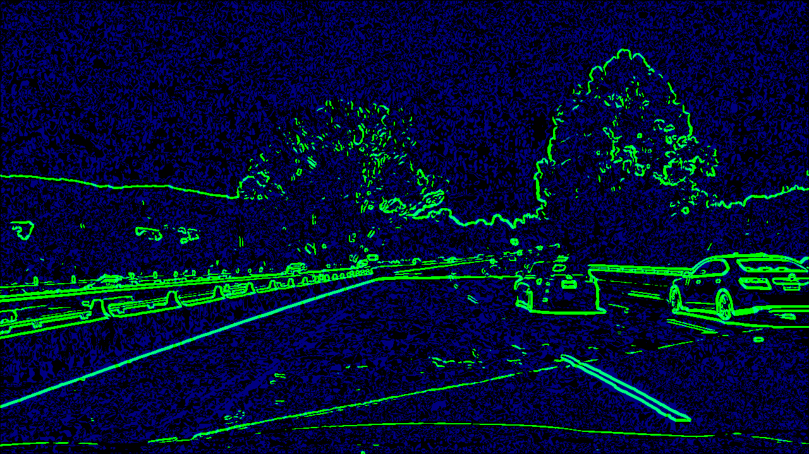 | 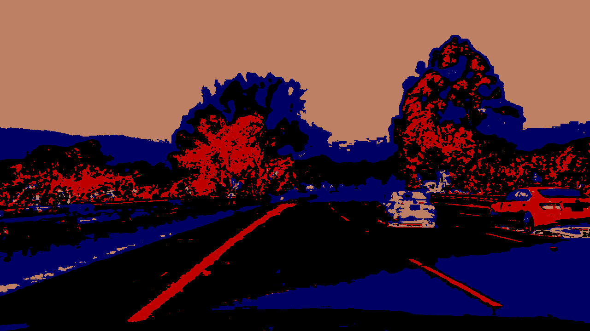 | 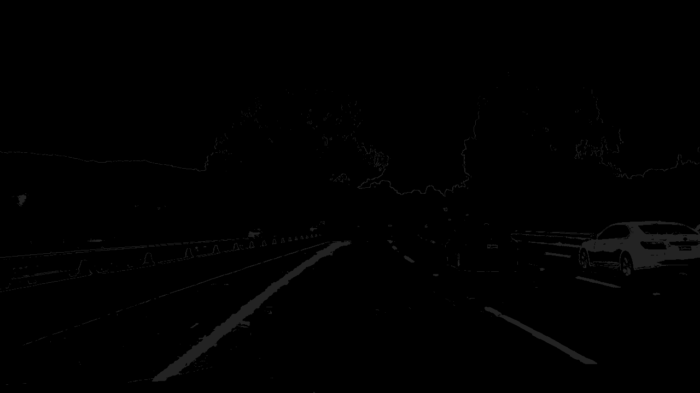

## Perspective Transform
