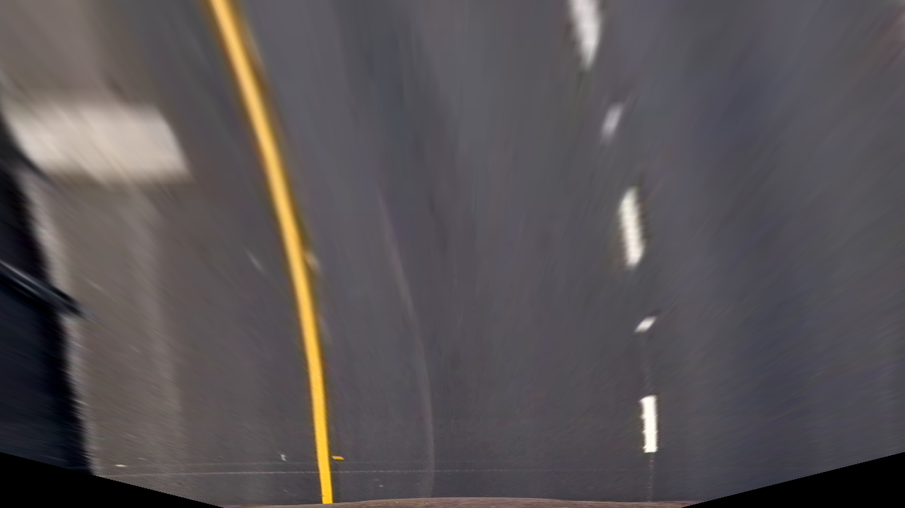
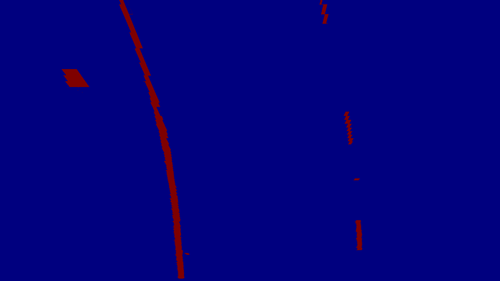
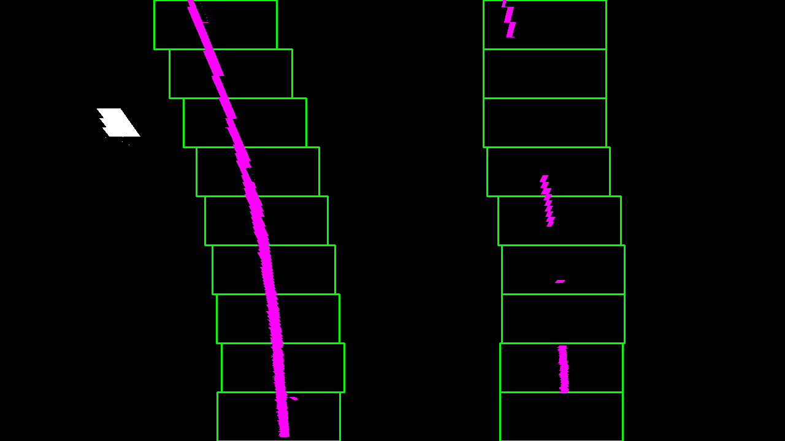

# Advanced_Lane_Finding

The goal of this project is to find lines on the highway video frame. In addition, it displays the radius of curvature and the offset from the car.

## Camera Calibration

In general, images or videos taken with the camera are distorted by the lens. These images can cause problems when calculating the radius of curvature or the centerline offset of the car. Perform camera calibration to correct this lens distortion. Calculated based on multiple images of a chess board shot with the same camera. You can then use this matrix to avoid distorting other images.
This project uses the calibration module implemented in opencv and saves it as a pickle file in Python and stores the camera metrics and distortion coefficients in advance.

Original                      |  Calibration
:----------------------------:|:------------------------------:
| 
| 

### Undistortion

The result of applying the calibration module to the image

Original                      |  Undistorted
:----------------------------:|:------------------------------:
| 
| 

## Lane Masking

After the lens distortion is removed, the image is processed by binarizing the pixel and setting the threshold to better locate the lane. The techniques used here are the sobel mask and the direction of gradient. To find the parameters of these techniques, you need to create and compare images multiple times.

The first technique converts the HLS color space to obtain the saturation value of the image, which is well detected in the saturation color space. The white line uses the cv2.equalizeHist () function to perform Histogram equalization.

Next, it is used to perform a Sobel mask to obtain gradients in the x and y directions and is used to obtain size and direction threshold images.

Finally, specify the area of interest and mask it so that it focuses on the road ahead of the vehicle.

The final combine is shown below.

Sobel X & Y                   |  Magnitude & Direction of Gradient  | HLS    | Combined
:----------------------------:|:-----------------------------------:|:------:|:----------:
|  |  | 
|  |  | 
|  |  | 

## Perspective Transform

After completed the Lane Masking step, proceed to Perspective Transformation. Perspective transformation that maps points of a given image to different image points with a perspective. In this step, you use the getPerspectiveTransform (src, dst) module of opencv to apply perspective transforms to obtain the bird's-eye view as shown in the figure below. This method is very useful when calculating lane curvature.

Reference                     |  Transformed
:----------------------------:|:-----------------------------------------------------------:
| 

This resulted in the following source and destination points:

| Source        | Destination   | 
|:-------------:|:-------------:| 
| 260, 680      | 320, 680      | 
| 1080, 680     | 950, 680      |
| 600, 450      | 320, 0        |
| 690, 450      | 950, 0        |

After Binary Thresholded Image

|Perspective transformed (Bird's eye view)
:----------------------------:|
|

## Identify Pixels and Fit Polynomial

Since not all pixels in the masked area are actually part of the lane, need to identify the most likely pixel. To make this possible, i use a sliding window search technique. Use the histogram of the pixels in the region to detect clusters of displayed pixels. The center of the sliding window search for the highest peak displayed in the histogram. It applies to the left half of the image, detects the left line pixels, and applies the right half of the image to detect the right lane pixels. Therefore, if the lane crosses the center of the image, the algorithm may fail.

Take a histogram along all the columns in the lower half of the image. The histogram plot is shown below.

The sliding window is displayed in green, and the left lane and the right lane are displayed in pink. The polynomial fit is indicated by a green line.

Sliding Window                     |Polynomial fit
:----------------------------:|:-----------------------------------------------------------:
| 

Applying a pipeline to a video frame can result in a lot of jitter between frames. To solve this we used smoothing / averaging before 10 frames without jitter. Polynomial fit works relatively well in frames that are not suitable.

## Calculates the curvature of the lane and vehicle position relative to the center.
The **curvature of the lanes** f(y) are calculated by using the formulae R(curve)

The **vehicle position** is calculated as the difference between the image center and the lane center.

## Reflection
The hard challenge is still not performed. Computer vision alone seems to have a limit. Backlighting is too fatal and the implementation is too complicated to consider all of the corner cases that break up rapidly. Also, since the current implementation can only clearly distinguish road lines, it is impossible to detect road lines that are blurred or twisty road lines in urban areas. The way to take all these cases into consideration is the deep-running approach.

